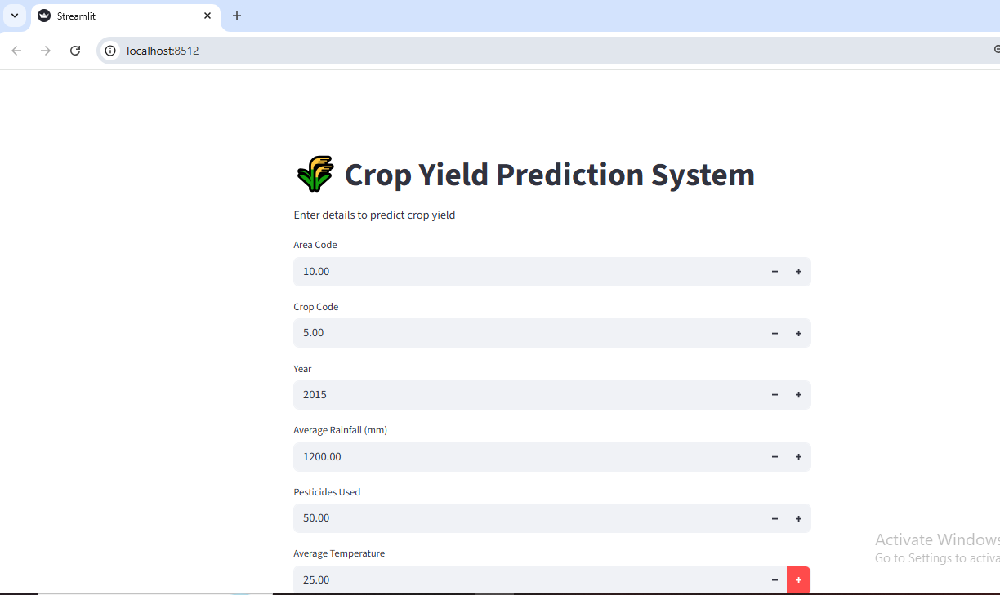
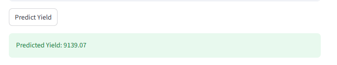

# 🌾 Crop Yield Prediction
### Machine Learning + Streamlit Web App

This project predicts crop yield based on environmental factors such as rainfall, temperature, and pesticide usage.

---

## 🚀 Features
- Predict crop yield using a trained machine learning model
- Simple and interactive web app using Streamlit
- Clean and structured dataset for analysis

---

## 🛠️ Tech Stack
- Python
- Pandas
- Scikit-learn
- Streamlit
- Joblib

---

## 📊 Model Used
- Random Forest Regressor

---

## 🔄 Project Workflow
1. Collected and prepared agricultural data  
2. Cleaned and selected important features  
3. Trained a machine learning model  
4. Saved the model as a `.pkl` file  
5. Built a Streamlit app for predictions  

---

## 📷 App Screenshots

### Input Page

### Prediction Output

---

## ▶️ How to Run the Project

1. Clone the repository 