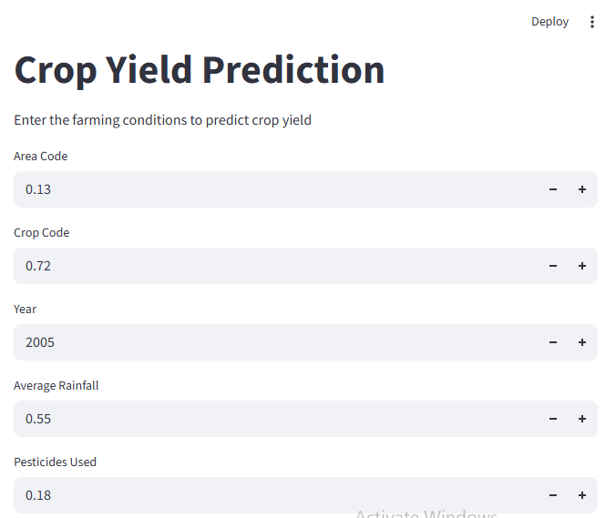
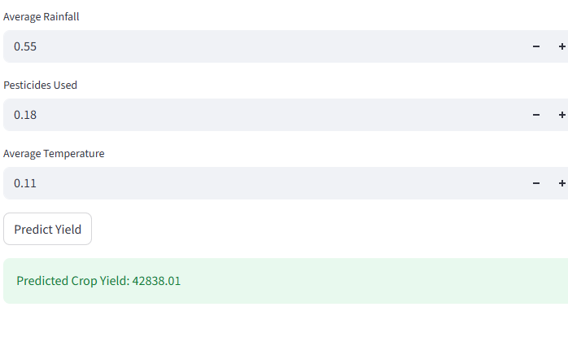

# 🌾 Crop Yield Prediction

This project predicts crop yield using Machine Learning based on environmental factors.

## 🚀 Features
- Predict crop yield using ML model
- Interactive web app using Streamlit
- Data analysis and visualization

## 🛠️ Tech Stack
- Python
- Pandas
- Scikit-learn
- Streamlit

## 📷 App Screenshots

### Input Page

### Prediction Output

## ▶️ How to Run

1. Install dependencies:
pip install -r requirements.txt

2. Run app:
streamlit run app.py

## 📌 Note
Model file excluded due to size. Can be generated using main.py.